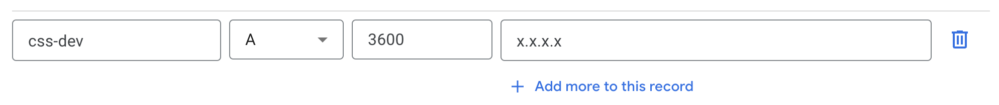

## Prerequisites

| Tool                | Required Version | Installation                                                                                                                                                                                        |
|---------------------|------------------|-----------------------------------------------------------------------------------------------------------------------------------------------------------------------------------------------------|
| `python`            | `>= 3.9`         | [Mac](https://www.python.org/ftp/python/3.9.18/python-3.9.18-macos11.pkg) • [Windows](https://www.python.org/downloads/release/python-3918/) • [Linux](https://docs.python.org/3.9/using/unix.html) |
| `gcloud` CLI        | `Latest`         | https://cloud.google.com/sdk/docs/install                                                                                                                                                           |
| `terraform`         | `>= v1.3.7`      | https://developer.hashicorp.com/terraform/downloads                                                                                                                                                 |
| `solutions-builder` | `>= v1.17.19`    | https://pypi.org/project/solutions-builder/                                                                                                                                                         |
| `skaffold`          | `>= v2.4.0`      | https://skaffold.dev/docs/install/                                                                                                                                                                  |
| `kustomize`         | `>= v5.0.0`      | https://kubectl.docs.kubernetes.io/installation/kustomize/                                                                                                                                          |

### Installing on Windows

We recommend you use (WSL)[https://learn.microsoft.com/en-us/windows/wsl/install] with (Ubuntu)[https://canonical-ubuntu-wsl.readthedocs-hosted.com/en/latest/guides/install-ubuntu-wsl2/] for the initial steps, up to the point where you have a jump host.  After that you should complete the install from the jump host.

### Troubleshooting Awareness

Please be aware of our [troubleshooting resources](https://github.com/GoogleCloudPlatform/core-solution-services/tree/main#troubleshooting) as they detail solutions to common issues found during the deployment process.

## Setup

### Set up the GCP Project

We recommend starting from a brand new GCP project. Create a new GCP project at https://console.cloud.google.com/projectcreate

### Install gcloud
(Install)[https://cloud.google.com/sdk/docs/install] the gcloud command line tool.


### Enable Cloud Identity Platform

Follow the steps below to enable Cloud Identity Platform and add Email/Password provider: (For Authentication)
- [components/authentication/README.md#enable-identity-platform](./components/authentication/README.md#enable-identity-platform)

### Check Org policies (Optional)

Make sure that policies are not enforced (`enforce: false` or `NOT_FOUND`). You must be an organization policy administrator to set a constraint.
- https://console.cloud.google.com/iam-admin/orgpolicies/compute-requireShieldedVm?project=$PROJECT_ID
- https://console.cloud.google.com/iam-admin/orgpolicies/requireOsLogin?project=$PROJECT_ID
```
gcloud resource-manager org-policies disable-enforce constraints/compute.requireOsLogin --project="${PROJECT_ID}"
gcloud resource-manager org-policies delete constraints/compute.vmExternalIpAccess --project="${PROJECT_ID}"
gcloud resource-manager org-policies delete constraints/iam.allowedPolicyMemberDomains --project="${PROJECT_ID}"
```

### Clone repo

Clone this repo to your local machine to start. Optionally, you can use [Cloud Shell](https://cloud.google.com/shell). Run the rest of the commands inside the repo folder.

```
git clone https://github.com/GoogleCloudPlatform/core-solution-services
cd core-solution-services
```

### Verify your Python version and create a virtual env
Make sure you have Python version 3.9 or greater.
```
python3 --version
```
Create a virtual environment and activate it.
```
python3 -m venv .venv
source .venv/bin/activate
```

### Install Solutions Builder package
```
pip install -U solutions-builder

# Verify Solution Builder CLI tool with version >= v1.17.19
sb version
```

### Set up `gcloud` CLI
```
export PROJECT_ID=<my-project-id>
gcloud auth login
gcloud auth application-default login
gcloud config set project ${PROJECT_ID}
```

### Update Project ID
Run this command to update the project id in config files of your local repo.
```
sb set project-id ${PROJECT_ID}
```

### Set up a Jump Host

> If you choose to run this setup in your local machine, you can skip this section. However, we recommend using a jump host to ensure a consistent install environment.

Run the following to create a Compute Engine VM as the jump host.
```
sb infra apply 0-jumphost
```
- Please note it may take 5-10 minutes to install dependencies in the VM.

Log into the jump host:
```
export JUMP_HOST_ZONE=$(gcloud compute instances list --filter="name=(jump-host)" --format="value(zone)")
echo Jump host zone is ${JUMP_HOST_ZONE}
gcloud compute ssh jump-host --zone=${JUMP_HOST_ZONE} --tunnel-through-iap --project=${PROJECT_ID}
```

Check the status of the installation:
```
ls -la /tmp/jumphost_ready
```
- If the file `jumphost_ready` exists, it means the jumphost is ready to deploy the rest of the resources.  If not, please wait for a few minutes.
- You should start with a clean copy of the repository.

Check out the code in the jump host:
```
git clone https://github.com/GoogleCloudPlatform/core-solution-services
```

Initialize the jump host and set Project ID:
```
gcloud auth login
gcloud auth application-default login

# Set PROJECT_ID
export PROJECT_ID=$(gcloud config get project)
echo PROJECT_ID=${PROJECT_ID}

# Update all project_id value in the source code.
cd core-solution-services
sb set project-id ${PROJECT_ID}

# Update domain name (for HTTPS load balancer and ingress)
export DOMAIN_NAME=<my-domain-name> # e.g. css.example.com
sb vars set domain_name ${DOMAIN_NAME}

# Set up API_BASE_URL for the frontend app:
export API_BASE_URL=https://${DOMAIN_NAME}
```

Run the rest of the deployment steps from within this jumphost.

### Initialize the Cloud infra

Apply infra/terraform:
```
sb infra apply 1-bootstrap
```

Note in the following step there is a known issue with firebase setup: `Error 409: Database already exists.`  If this error occurs, run the step, consult the Troubleshooting section to apply the fix, then re-run the step.

```
sb infra apply 2-foundation
```

Proceed with the install:

```
sb infra apply 3-gke
sb infra apply 3-gke-ingress
```

(Optional) Add an A record to your DNS:

- Set the IP address in the A record to the external IP address in the ingress.

- Apply infra/terraform for LLM service:

```
sb infra apply 4-llm
```
- This will create a GCE load balancer with ingress.
- This will create a `$PROJECT_ID-llm-docs` bucket and upload the sample doc `llm-sample-doc.pdf` to it.
- It will add required Firestore indexes.


### Before Deploy

Follow README files for the microservices below to complete set up:
- LLM Service: [components/llm_service/README.md](./components/llm_service/README.md#setup) (Only Setup section)
  - We recommend deploying AlloyDB and PG Vector as a vector store.  See the section on AlloyDB in the LLM Service [README](components/llm_service/README.md)
- Tools Service:  If you are using the Tool Service (for GenAI agents that use Tools) follow the instructions in the [README](components/tools_service/README.md)

## Deploy Backend Microservices

Set up `kubectl` to connect to the provisioned GKE cluster
```
export REGION=$(gcloud container clusters list --filter=main-cluster --format="value(location)")
gcloud container clusters get-credentials main-cluster --region ${REGION} --project ${PROJECT_ID}
kubectl get nodes
```

### Option 1: Deploy GENIE microservices to the GKE cluster
If you are installing GENIE you can deploy a subset of the microservices necessary for GENIE:

```
NAMESPACE=default
sb deploy -m authentication,llm_service,jobs_service,tools_service,frontend_streamlit -n $NAMESPACE
```
- This will run `skaffold` commands to deploy all microservices to the GKE cluster.

Check the status of the pods:

```
kubectl get pods
```

### Option 2: Deploy all microservices to GKE cluster
If you wish to deploy all microservices in Core Solution Services use the following command:

```bash
NAMESPACE=default
sb deploy -n $NAMESPACE
```
- This will run `skaffold` commands to deploy all microservices to the GKE cluster.

Check the status of the pods:

```
kubectl get pods
```

### Deploy ingress to GKE cluster:
```bash
cd ingress
skaffold run -p default-deploy -n $NAMESPACE --default-repo="gcr.io/$PROJECT_ID"
```
### After deployment

- Follow [components/authentication/README.md#create-users](./components/authentication/README.md#create-users) to create the first user.
  - You will need the output ID Token for the next step.
- Follow [components/llm_service/README.md](./components/llm_service/README.md#after-deployment) to create the BOT account and a Query Engine.

### Verify deployment

Once deployed, check out the API docs with the following links:

- Frontend Flutterflow app:
  - https://$YOUR_DNS_DOMAIN

- Frontend Streamlit app:
  - https://$YOUR_DNS_DOMAIN/streamlit

- Backend API documentations:
  - https://$YOUR_DNS_DOMAIN/authentication/api/v1/docs
  - https://$YOUR_DNS_DOMAIN/user-management/api/v1/docs
  - https://$YOUR_DNS_DOMAIN/jobs-service/api/v1/docs
  - https://$YOUR_DNS_DOMAIN/llm-service/api/v1/docs

Alternatively, you can test with the IP address to verify API endpoints
```
BASE_IP_ADDRESS=$(gcloud compute addresses list --global --format="value(address)")
```
- Open up `http://$BASE_IP_ADDRESS/authentication/api/v1/docs` in a web browser.

In the GCP Console, check the following:
- A query engine at https://console.cloud.google.com/vertex-ai/matching-engine/indexes?referrer=search&project=$PROJECT_ID.
- A vertex AI endpoint to the query engine at https://console.cloud.google.com/vertex-ai/matching-engine/index-endpoints?referrer=search&project=$PROJECT_ID

## Frontend applications

When running `sb deploy` like above, it automatically deploys Streamlit-based and FlutterFlow-based frontend apps
altogether with all services deployment.
- Once deployed, you can verify the FlutterFlow frontend app at `https://$YOUR_DNS_DOMAIN` in a web browser.
- Once deployed, you can verify the Streamlit frontend app at `https://$YOUR_DNS_DOMAIN/streamlit` in a web browser.

> [FlutterFlow](https://flutterflow.io/enterprise) is a low-code development platform that enables you to build native mobile and web applications without writing code.

> [Streamlit](https://streamlit.io) is an open-source Python library that makes it easy to create custom web apps. It's a popular choice for data scientists and machine learning engineers who want to quickly create interactive dashboards and visualizations

### (Optional) Deploy or run the frontend apps manually

See [docs/flutterflow_app.md](docs/flutterflow_app.md) to clone and deploy a FlutterFlow app.

See [components/frontend_streamlit/README.md](components/frontend_streamlit/README.md) for options to run or deploy the Streamlit app.

## Troubleshooting

Please refer to [TROUBLESHOOTING.md](https://github.com/GoogleCloudPlatform/solutions-builder/blob/main/docs/TROUBLESHOOTING.md) for any Terraform errors

### Firestore database already exists
```commandline
╷
│ Error: Error creating Database: googleapi: Error 409: Database already exists. Please use another database_id
│
│   with google_firestore_database.database,
│   on firestore_setup.tf line 42, in resource "google_firestore_database" "database":
│   42: resource "google_firestore_database" "database" {
│
╵
```
Fix
```commandline
cd terraform/stages/2-foundation/
terraform import google_firestore_database.database "(default)"
cd -
```

### Running user-tool gives an error
```commandline
user@jump-host:/home/user/core-solution-services$ PYTHONPATH=components/common/src/ python components/authentication/scripts/user_tool.py create_user --base-url=$BASE_URL
API base URL: http://x.x.x.x
User email (user@example.com):
/home/user/.local/lib/python3.9/site-packages/google/cloud/firestore_v1/base_collection.py:290: UserWarning: Detected filter using positional arguments. Prefer using the 'filter' keyword argument instead.
  return query.where(field_path, op_string, value)
```
Fix
```commandline
pip install -r components/common/requirements.txt
pip install -r components/authentication/requirements.txt
```

### Docker not working for current user
```commandline
docker: Got permission denied while trying to connect to the Docker daemon socket at unix:///var/run/docker.sock: Post "http://%2Fvar%2Frun%2Fdocker.sock/v1.24/containers/create": dial unix /var/run/docker.sock: connect: permission denied.
```
Fix
```commandline
sudo usermod -aG docker ${USER}
```
Log out and log back in again to re-evaluate group memberships
