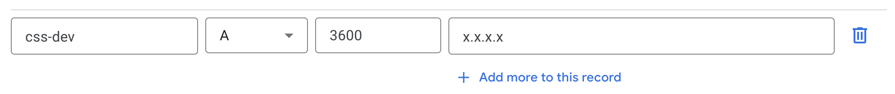

# Core Solution Services

> This codebase is generated from https://github.com/GoogleCloudPlatform/solutions-builder

## Prerequisite

| Tool | Required Version | Installation |
|---|---|---|
| Python                 | &gt;= 3.9     | |
| gcloud CLI             | Latest        | https://cloud.google.com/sdk/docs/install |
| Terraform              | &gt;= v1.3.7  | https://developer.hashicorp.com/terraform/downloads |
| Skaffold               | &gt;= v2.4.0  | https://skaffold.dev/docs/install/ |
| Kustomize              | &gt;= v5.0.0  | https://kubectl.docs.kubernetes.io/installation/kustomize/ |
| solutions-builder CLI | &gt;= v1.13.0 | https://github.com/GoogleCloudPlatform/solutions-builder |

## Setup

### Create a new Google Cloud project

We'd recommend starting from a brand new GCP project. Create a new GCP project at [https://console.cloud.google.com/projectcreate]

### Install Solutions Builder package
```
pip install -U solutions-builder
```

### Set up gcloud CLI
```
export PROJECT_ID=<my-project-id>
gcloud auth login
gcloud auth application-default login
gcloud config set project $PROJECT_ID
```

Initialize the Cloud infra:
```
sb set project-id $PROJECT_ID
sb infra apply 1-bootstrap
```

Log in to the bastion host.
```
# TBD
```

Set up Cloud foundation and GKE cluster

```
sb infra apply 2-foundation
sb infra apply 2-gke
```

### Add a HTTP Load balancer with DNS domain
```
sb components add terraform_gke_ingress
```

Update the following questions in the promopt:
```
🎤 Cluster external endpoint IP address?
   x.x.x.x
🎤 Kubernetes service names in ingress? (comma-separated string)
   authentication,jobs-service,llm-service,user-management
🎤 DNS domains (comma-separated string)?
   example.domain.com
```
- Note: You can leave the DNS domains as empty if you don't have any custom domains. If so, you'd use IP address to connect to API endpoints later on.

Apply terraform for GKE ingress:
```
sb infra apply 3-gke-ingress
```

(Optional) Add an A record to your DNS:

- Set the IP address to the external IP address in the ingress.

## Deploy

### Set up each microservice:

Follow README files of each microservice to setup:
- Authentication: [components/authentication/README.md](./components/authentication/README.md)
- LLM Service: [components/llm_service/README.md](./components/llm_service/README.md)

### Deploy all microservices (optionally with Ingress) to GKE cluster:
```
sb deploy
```

### Set up admin user

In the source code:
```
PYTHONPATH=components/common/src/ python components/authentication/src/utils/setup.py create_admin --base-url=https://your.domain.com/
```
- You can use the IP address, e.g. https://127.0.0.1/
- This will add the `admin` user to the Firestore (`users` collection).

Once complete, it will show the ID token in the output. E.g.:
```
User 'admin@my.domain.com' created successfully. ID Token:

<my-id-token...>
```

### Verify deployed APIs

Once deployed, check out the API docs with the following links:
- https://$CLUSTER_IP_ADDRESS/authentication/api/v1/docs
- https://$CLUSTER_IP_ADDRESS/user-management/api/v1/docs
- https://$CLUSTER_IP_ADDRESS/jobs-service/api/v1/docs
- https://$CLUSTER_IP_ADDRESS/llm-service/api/v1/docs
