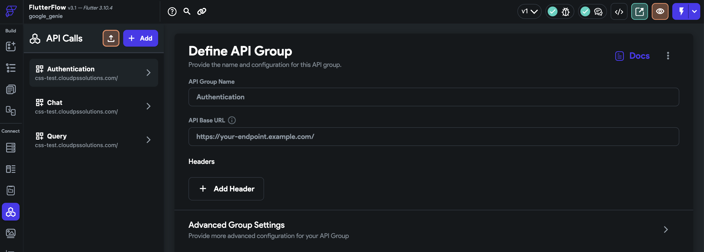

# Core Solution Services

> This codebase is generated from https://github.com/GoogleCloudPlatform/solutions-builder

Core Solution Services (CSS) is a group of foundational microservices, data models and other features, 
implemented in Python and running on Kubernetes. It supports common functionality needed by solutions 
built for different industries, like authentication, user management, data storage, and job management, 
and includes CI/CD and e2e testing.  CSS may be used as a stand-alone platform, or as an foundational layer 
to accelerate the building of specific applications.  It also includes a generic capability for GenAI 
use cases.  To date the microservices in CSS have been deployed in production for a variety of customers 
in the Public Sector division of Google Cloud.

## Use Cases

We have built an initial use case to support GenAI for Enterprise, and there will be more use
cases to come soon.

### GenAI for Enterprise (GENIE)

We are building core services used for GenAI and Enterprise Search use cases, with built-in
flexibility to leverage a number of LLMs like VertexAI, ChatGPT 3.5/4, Cohere, and more to come.

Highlighted features:
- Enable any enterprise to leverage a chatbot to answer any questions based on their selected
  content such as a list of documents, databases, etc.
- Easy to plug in and use any LLM models available in the market, leveraging Langchain.
- Provides a ready-to-deploy frontend app to showcase the E2E user workflow.

## Prerequisites

| Tool | Required Version | Installation |
|---|---|---|
| Python                 | &gt;= 3.9     | |
| gcloud CLI             | Latest        | https://cloud.google.com/sdk/docs/install |
| Terraform              | &gt;= v1.3.7  | https://developer.hashicorp.com/terraform/downloads |
| Skaffold               | &gt;= v2.4.0  | https://skaffold.dev/docs/install/ |
| Kustomize              | &gt;= v5.0.0  | https://kubectl.docs.kubernetes.io/installation/kustomize/ |
| solutions-builder CLI | &gt;= v1.13.0 | https://github.com/GoogleCloudPlatform/solutions-builder |

## Setup

### Create a new Google Cloud project

We recommend starting from a brand new GCP project. Create a new GCP project at [https://console.cloud.google.com/projectcreate]

### Install Solutions Builder package
```
pip install -U solutions-builder
```

### Set up gcloud CLI
```
export PROJECT_ID=<my-project-id>
gcloud auth login
gcloud auth application-default login
gcloud config set project $PROJECT_ID
```

Initialize the Cloud infra:
```
sb set project-id $PROJECT_ID
sb infra apply 1-bootstrap
```

Enable Cloud Identity Platform (For Authentication)
- https://console.cloud.google.com/marketplace/details/google-cloud-platform/customer-identity

Log in to the bastion host.
```
# TBD
```

Set up Cloud foundation and GKE cluster
```
sb infra apply 2-foundation
sb infra apply 2-gke
```

### Add a HTTP Load balancer with DNS domain
```
sb components add terraform_gke_ingress
```

Update the following questions in the promopt:
- Cluster external endpoint IP address?
  - (The IP address will be automatically retrieved)
- Kubernetes service names in ingress? (comma-separated string)
  - **authentication,jobs-service,llm-service,user-management**
- DNS domains (comma-separated string)?
  - (Your DNS domain)
  > Note: You can leave a dummy DNS domain if you don't have any custom domains. If so, you'd use IP address to connect to API endpoints later on.

Apply terraform for GKE ingress and LLM service:
```
sb infra apply 3-gke-ingress
sb infra apply 3-llm
```
- This will create a GCE load balancer with ingress.
- This will create a `$PROJECT_ID-llm-docs` bucket and upload the sample doc `llm-sample-doc.pdf` to it.
- It will add required Firestore indexes.

(Optional) Add an A record to your DNS:

- Set the IP address to the external IP address in the ingress.

## Deploy

### Before Deploy

Follow README files of each microservice to setup:
- Authenication [components/authentication/README.md](./components/authentication/README.md#retrieve-firebase-api-key) to retrieve Firebase API key
- LLM Service: [components/llm_service/README.md](./components/llm_service/README.md#setup) (Only Setup section)

### Deploy all microservices and ingress to GKE cluster:
```
sb deploy
```

### After deployment

- Follow [components/authentication/README.md#create-users](./components/authentication/README.md#create-users) to create the first user.
  - You will need the output ID Token for the next step.
- Follow [components/llm_service/README.md](./components/llm_service/README.md#after-deployment) to create a Query Engine.

### Verify deployment

Once deployed, check out the API docs with the following links:
- https://$YOUR_DNS_DOMAIN/authentication/api/v1/docs
- https://$YOUR_DNS_DOMAIN/user-management/api/v1/docs
- https://$YOUR_DNS_DOMAIN/jobs-service/api/v1/docs
- https://$YOUR_DNS_DOMAIN/llm-service/api/v1/docs

> Alternative you can link with IP address e.g. http://x.x.x.x/authentication/api/v1/docs to verify API endpoints.

In the GCP Console, check the following
- A query engine
- A vertex AI endpoint to the query engine

### Deploy GenAI FlutterFlow app (WIP)

Follow the steps below to clone a FlutterFlow UI app:
- Register a FlutterFlow free tier account: https://app.flutterflow.io/create-account
- Go to the [Demo FlutterFlow app](https://app.flutterflow.io/project/google-genie-public-xwz8vb) and click **[Clone]** on the top-right to make a copy of the FlutterFlow app to your account.
  
- Once cloned, on the left panel menu, go to [API Calls] page.
- In each section (Authentication, Chats, Query), change the `API base URL` to your API base URL.
  
- Publish the app by clicking "Thunder" icon at the top-right menu.
