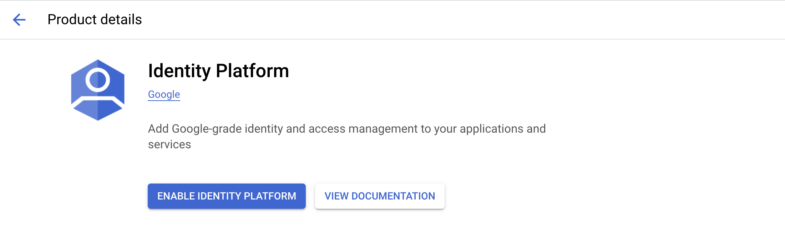
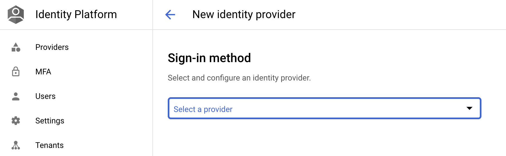
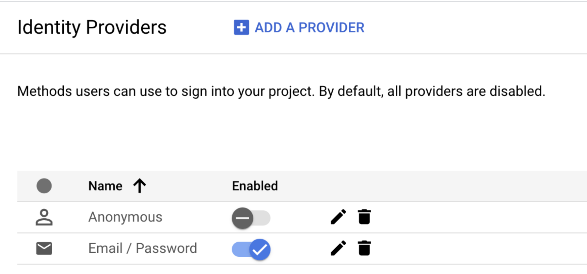
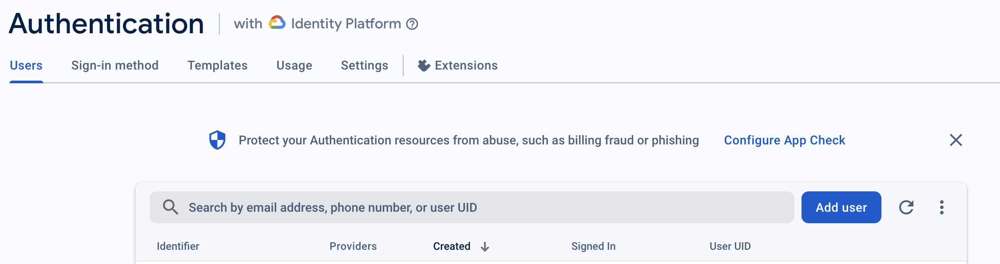

# Authentication Service

## Setup

### Enable Identity Platform

- Go to GCP console and [enable the Identity Platform](https://console.cloud.google.com/customer-identity).
  

- Add an Email/Password provider [in Identity Platform page](https://console.cloud.google.com/customer-identity/providers):
  

- Make sure to enable the Email/Password provider as the screenshot below:
  


## Automatic User Creation with whitelisted email domains

Set the following two environment variables:
```
export AUTH_AUTO_CREATE_USERS=true
export AUTH_EMAIL_DOMAINS_WHITELIST=google.com
```
- Please note that `AUTH_EMAIL_DOMAINS_WHITELIST` matches exact email domain, not wildcard support yet.

## Manually add Users

### Add users with the firebase console
Please verify that email/password provider is enabled.

You can add users to the platform in the [firebase console](https://console.firebase.google.com).

- Navigate to the console and select your project
- Navigate to the Authentication section (under Build > Authentication)
- Click "Add User" on the UX.
  
- Enter the email and password for the user.
- You can send a password reset email to the user via firebase so the user can create their own password.
- The user can now log in via the UX apps for the platform.
- A user model will be created for the user when they log in.  Note that user model will be populated with test first name/last name and should be updated if you care about those fields.

### Add users with the create_users script
Please verify that email/password provider is enabled.

Get the IP address for the GKE ingress endpoint:
```
IP_ADDRESS=$(gcloud compute addresses describe gke-ingress-ip --global --format='value(address)')
BASE_URL="http://$IP_ADDRESS"
```

In the source code folder:
```
pip install -r components/common/requirements.txt
pip install -r components/authentication/requirements.txt
PYTHONPATH=components/common/src/ python components/authentication/scripts/user_tool.py create_user --base-url=$BASE_URL
```
- You can use the IP address, e.g. http://127.0.0.1/
- This will register the user to Identity Platform and a user record in Firestore (in `users` collection).

Once complete, it will show the ID token in the output. E.g.:
```
User 'user@my.domain.com' created successfully. ID Token:

<my-id-token...>
```

### Get an ID Access Token

Get an access token for a particular user:
```
PYTHONPATH=components/common/src/ python components/authentication/scripts/user_tool.py get_token
```
- This will print out the token in the terminal.

```
Signed in with existing user 'user@my.domain.com'. ID Token:

<my-id-token...>
```
